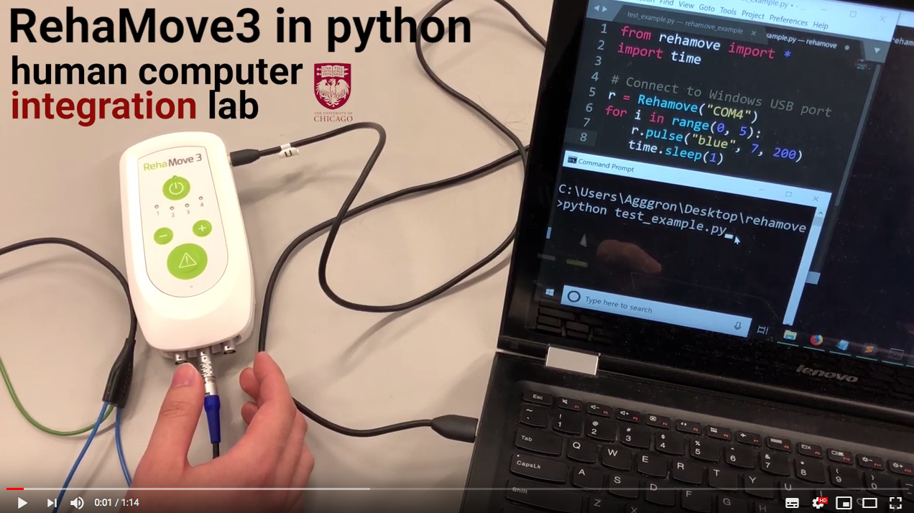
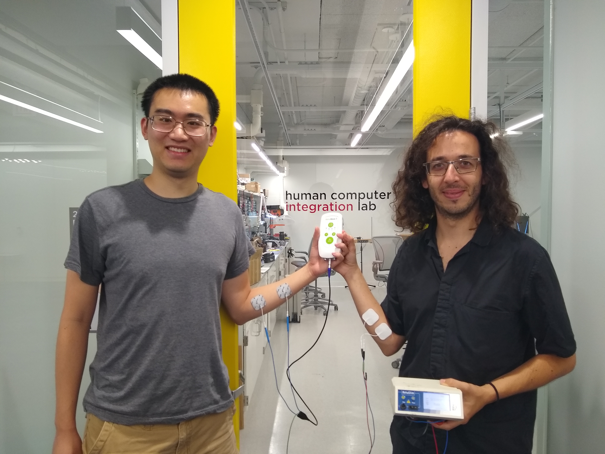

# EMS Integration Lib: Python and C# Extensions for Hasomed's RehaMove 1, Rehamove 3 and OpenEMSstim (v1.6)

This is the **rehamoveIntegrationLib**, a collection of libraries (for non-commercial use only) that interface with distinct electrical/functional muscle stimulation units (known as EMS or FES):

* Hasomed's RehaMove 3 EMS/FES device (here!) 
* Hasomed's RehaMove 1 EMS/FES device (comming soon!) 
* [openEMSstim](https://github.com/PedroLopes/openEMSstim) controllers (not a stimulator, just an intensity adjuster)


You can find the project's official page [here](https://lab.plopes.org/rehalib).


(click [here](https://youtu.be/IyL0C_fEE2A) for our youtube video)

**What does this do?** The RehaMove 3 is a medical device that sends out electrical signals, which can be used clinically and in research, e.g. by doing functional electrical stimulation (FES) and/or electrical muscle stimulation (EMS). Existing documentation is provided by the manufacturer Hasomed to control the RehaMove via C code using a precompiled C library. **Instead, our libraries extend this functionality to Python and C#**, allowing the user to send commands in these other programming languages. This can be used for rapid prototyping, and/or integration with engines such as Unity3D.

## 0. A must read before using

1. Read the LICENSE (when it exists) and [Liability Waiver](https://github.com/PedroLopes/openEMSstim/blob/master/documentation/liability_waiver.md)
2. Read the [what-not-to-do list](https://github.com/PedroLopes/openEMSstim/blob/master/start-here-tutorials/0.WhatNotToDo.md).
3. Never tried EMS before? Then, [watch our tutorial of applying EMS first](http://plopes.org/ems/#testingEMSmachine).


## 1. How to install

### 1.1 Python (2 and 3, we have each of these builds on a separate folder, by default we assume you are building for Python 3)

We support several versions of the library for different systems. After downloading the files, **move the files to your working directory** (where you will run Python from). These instructions assume use of the 64-bit version of Python 3; we also have libraries for the 64-bit version of Python 2 as well as the 32-bit version of Python 3.

#### 1.1.1 Linux (both AMD64 and ARM v7+) 

* [Nightly Linux AMD64 zip](https://lab.plopes.org/rehamove/python-linux_amd64.zip) 
* [Nightly Linux ARM V7+ zip](https://lab.plopes.org/rehamove/python-linux_ARM.zip) 
* [Most-recent source code for AMD64](https://github.com/humancomputerintegration/rehamove-integration-lib/tree/master/builds/python/linux_amd64/) 
* [Most-recent source code for ARM V7+](https://github.com/humancomputerintegration/rehamove-integration-lib/tree/master/builds/python/linux_ARM) 

On Linux make sure you have the following files (for your desired architecture, either AMD64 or ARM V7+):

1. `rehamove.py`
2. `rehamovelib.py`
3. `_rehamovelib.so`

#### 1.1.2 MacOS (AMD64)

* [Nightly MacOS 64 zip](https://lab.plopes.org/rehamove/python-macOS.zip) 
* [Most-recent source code for MacOS AMD64](https://github.com/humancomputerintegration/rehamove-integration-lib/tree/master/builds/python/macOS/) 

On MacOS make sure you have the following files (only for 64 bit machines):

1. `rehamove.py`
2. `rehamovelib.py`
3. `_rehamovelib.so`


#### 1.1.3 Windows

* [Nightly Windows 64-bit (only) zip](https://lab.plopes.org/rehamove/python-windows_amd64.zip) 
* [Most-recent source code for Windows 64-bit (only)](https://github.com/humancomputerintegration/rehamove-integration-lib/tree/master/builds/python/windows_amd64/) 

For Windows, we support 64-bit (aka AMD64) architectures. Make sure you have the following files:

1. `rehamove.py`
2. `rehamovelib.py`
3. `_rehamovelib.pyd`

### 1.2 C\# (for Unity3D in Windows)

* [Nightly Windows 64-bit (only) zip for C#](https://lab.plopes.org/rehamove/csharp-windows_amd64.zip) 
* [Most-recent source code for Windows 64-bit (only) C\#](https://github.com/humancomputerintegration/rehamove-integration-lib/tree/master/builds/csharp).

We support C# for Unity3D integration on Windows-only. Make sure you have the following files:

1. `rehamovelib.dll`
2. `UnityRehamove.dll`

After downloading the files, **move the downloaded files into the Assets folder of your Unity project**.

(Theoretically our build might work also on Linux and Mac; if you got C# to run on those platforms, write us an email. )

## 2. Controlling the Rehamove via our library

This section explains how to use our libraries, including example code demonstrating imports and calling the library functions.

See our video tutorial:
[](https://youtu.be/IyL0C_fEE2A)

### 2.1 Python

You can import the libraries into your own Python scripts. For example, the following script `test_example1.py` was included in the tutorial video (here for Windows): 

```
from rehamove import *          # Import our library
import time

r = Rehamove("COM4")            # Open USB port (on Windows)
for i in range(0, 5):
    r.pulse("blue", 6, 200)     # Send pulse every second
    time.sleep(1)
```

Scripts like these can be invoked from the command line, using `python3 test_example1.py` or its equivalent.

In addition, our libraries can also be imported in interactive Python sessions. Example:

```
python
> from rehamove import *                                # Import our library
> r = Rehamove("/dev/ttyUSB0")                          # Open USB port (on Linux)
> r.version()                                           # Query battery life
> r.battery()                                           # Query battery life
> r.pulse("blue", 5, 200)                               # Send single pulse
> r.custom_pulse("blue", [(5.0, 200), (-5.0, 200)])     # Send pulse with custom waveform
> r.change_mode(1)                                      # Change to mid-level mode
> r.set_pulse(5, 200)                                   # Set the pulse used in mid-level mode
> r.run("blue", 100, 10000)                             # Run that set pulse every 100 ms for 10s total
> exit()                                                # Automatically closes port
```

### 2.2 C\# (Unity3D)

You can write C# scripts in your Unity3D project that call our library functions: Example:
```
...
using UnityRehamove;

public class NewBehaviourScript : MonoBehaviour
{
    Rehamove r = null;

    void Start() {
        r = new UnityRehamove.Rehamove("COM3");
        StartCoroutine(Pulse());
    }

    IEnumerator Pulse() {
        for (int i = 0; i < 10; i++) {
            r.pulse("blue", 6, 200);
            yield return new WaitForSeconds(1.0f);
        }
        yield return 0;
    }

    void OnApplicationQuit() {
        r.close();
    }
}
```

## 3. What is supported?

This section describes the list of functions that our libraries currently support. In the future, we hope to support all of the API (link?) provided by the RehaMove manufacturers.

### 3.1 Python

* `r = Rehamove(port_name)`: Constructor to initialize the device. **Save the return value to a variable! This return value is the object upon which you invoke the other functions.** The call for `Rehamove()` takes in one argument, the port name (for example **/dev/ttyUSB0** on Linux or **COM3** on Windows, etc.). It returns a `Rehamove` object with the device connection saved as `Rehamove.rehamove`, so (as mentioned) remember to assign it. The creation of a `Rehamove` object automatically opens the port, unless an error occurs while opening the port (e.g., wrong port name, etc). 

    * Error handling when creating new `Rehamove` object: we currently do not have exception handling but we have error printing. Thus, your best option to handle this in code is to test whether your variable that holds the object is `None` (e.g., `if r.rehamove == None`). One nice way to have a `while` loop that attempts connections until the device connection is not  `None` -- this allows you to have a Python script that infitely tries to get the port to connect to the device. See [one of our examples](https://github.com/humancomputerintegration/rehamove-integration-lib/blob/master/src/python/examples/connect_midway.py).

* `r.version()`: Gets the version of the library used.

All of the remaining functions require that the Rehamove object is correctly initialized; otherwise, an error is generated.

* `r.info()`: Gets information about the connected device, including the currently active mode. The device has two modes, low-level and mid-level:
    * Low-level: The user sends a command for each individual pulse. **This is the default mode.**
    * Mid-level: The user presets the pulse parameters, and can command the Rehamove to automatically send that pulse with a user-defined period. `r.info()` allows the user to see the device's preset pulse parameters.

* `r.battery()`: Queries the device for the battery percentage. Prints the battery percentage. Also, *returns **integer representing the battery percentage** on success, and -1 on failure.*

* `r.change_mode(mode)`: Changes the mode for the device. *Returns 0 on success, -1 on failure.* The options are:
    * `0`: Low-level mode.
    * `1`: Mid-level mode.

* `r.pulse(channel_name, current, pulse_width)`: **Low-level mode only.** Sends a single pulse. *Returns 0 on success, -1 on failure.* Takes in three arguments:
	* The output channel. There are four possible outputs for the Rehamove: the red channel, the blue channel, and two outputs for the grey channel. They can be specified in any of the following ways:
        * Red channel: `0`, `"r"`, `"red"`
        * Blue channel: `1`, `"b"`, `"blue"`
        * First gray channel: `2`, `"g1"`, `"gray1"`, `"grey1"`, `"black"`
        * Second gray channel: `3`, `"g2"`, `"gray2"`, `"grey2"`, `"white"`
	* The current intensity, **in milliAmperes (mA)**.
	* The length of the pulse, **in microseconds (us)**.

* `r.custom_pulse(channel_name, points_array)`: **Low-level mode only.** Sends a single pulse with a custom waveform. *Returns 0 on success, -1 on failure.* Takes in two arguments:
	* The output channel (see `pulse()` for explanation of the options).
	* An array of tuples, each tuple having two elements (a current (mA), and a pulse_width (us)). The custom waveform can support a **maximum of 16 points**. Sending an array with more than 16 points will only execute the first 16 points, and sending an array with less than 16 points will automatically create empty points (0.0, 0) to fill in the leftover number.

* `r.set_pulse(current, pulse_width)`: **Used in mid-level mode only, but can be called at any time.** Sets the pulse parameters for what will be used in mid-level mode. *Returns 0 on success, -1 on failure.* Takes in two arguments:
    * The current intensity, **in milliAmperes (mA)**.
    * The length of the pulse, **in microseconds (us)**.

* `r.run(channel_name, period, total_milliseconds)`: **Mid-level mode only.** Starts Rehamove stimulation that sends **the pulse set by `set_pulse()`**. In this function, mid-level stimulation is automatically initialized, and automatically stopped at the end. *Returns 0 on success, -1 on failure.* Takes in three arguments:
    * The output channel (see `pulse()` for explanation of the options).
    * The period, **in milliseconds (ms)**. A pulse will be sent every *period* ms, starting at 0ms.
    * The total time of stimulation, **in milliseconds (ms)**.

* `r.start(channel_name, period)`: **Mid-level mode only; in combination with update() and end().** Starts Rehamove stimulation that sends **the pulse set by `set_pulse()`**. In this function, mid-level stimulation is automatically initialized. A keep-alive signal (done by `update()`) must manually be called at least every two seconds; otherwise stimulation stops. Also, user must manually call `end()` at the end of the stimulation to properly stop mid-level stimulation (necessary if intending to switch back to low-level stimulation mode. *Returns 0 on success, -1 on failure.* Takes in two arguments:
    * The output channel (see **pulse()** for explanation of the options).
    * The period, **in milliseconds (ms)**. A pulse will be sent every *period* ms, starting at 0ms.

* `r.update()`: **Mid-level mode only; in combination with `start()` and `end()`.** Sends a keep-alive signal for any mid-level stimulation initialized by `start()`. This signal must be sent at least once every two seconds; otherwise that mid-level stimulation will stop. *Returns 0 on success, -1 on failure.* Takes in no arguments.

* `r.end()`: **Mid-level mode only; in combination with `start()` and `update()`.** Stops the mid-level stimulation initialized by `start()`. This signal must be sent at the end of the stimulation to properly stop mid-level stimulation, especially when switching back to low-level mode. *Returns 0 on success, -1 on failure.* Takes in no arguments.

* The connection port **automatically closes** open exiting the Python application.

### 3.2 C\# (Unity3D)

The supported functionality is almost entirely the same as for Python (see section for Python). 

Differences:

* `r.close()`: Closes the port (assuming that `r` is a Rehamove object created when opening the port. Unlike in the Python library, the port **does NOT automatically close** when the C# execution ends. The port must be manually closed with this function. It is possible to use Unity3D's `onApplicationQuit()` method to call this function automatically when the Unity3D program ends.
* The `r.custom_pulse(channel_name, points_array)` function currently does not exist in the C# implementation.

## 4. How to build/compile our libraries from source

This section is for developers interested in building/compiling our libraries from source. This project is compiled and linked with the Hasomed's Rehamove library (a precompiled C library). Our libraries were developed and compiled with version 3.2.4. You can find their latest version [here](https://www.rehamove.com/fileadmin/user_upload/RehaMove/ScienceMode/smpt_rm3_V3.2.4b.zip). 

In order to interface with Hasomed's precompiled C library our project uses [SWIG](http://www.swig.org/). 

### 4.0 General dependencies
Install SWIG (you may have to also download PCRE, `configure`, `make`, and `make install`).

### 4.1 Python

The files needed for building include:

* `rehamovelib.c`: Our functions in C that call functions from Hasomed's existing C library
* `rehamovelib.i`: An interface file of function declarations used for SWIG wrapper generation
* `rehamove.py`: Our own Python wrapper to run on top of SWIG's generated wrapper

See the [src directory](https://github.com/humancomputerintegration/rehamove-integration-lib/tree/master/src/python) for these source files for Python.

#### 4.1.1 Python on Linux (64 bit architectures, i.e., AMD64)

We generated the shared library file by:
1. Invoking SWIG
2. Compiling the C source files
3. Linking our libraries with Hasomed's precompiled library 

See our [example](https://github.com/humancomputerintegration/rehamove-integration-lib/blob/master/src/python/linux_amd64/build.sh) for a build script in the terminal. 

The shared library output, `_rehamovelib.so`, can be included with the wrappers (`rehamovelib.py` and `rehamove.py`) for final use.

Some notes:

* SWIG can compile for several languages (here we use the `-python` flag). It takes an interface file as input (here `rehamovelib.i`), and generates wrapper files.
* The `-fPIC` flag is used to specify position-independent code, since we are building a shared library.
* The Hasomed C library we use is the version: `smpt_rm3_gcc_linux_x86_amd64_static`.
* When compiling, we use the `-I` flag to include paths to the C header files.
* Additionally, we include paths to the Python header files.
* When linking, we use the `-L` flag we include the path to the precompiled C library.

#### 4.1.2 Python on Linux for ARM architectures

We tested our project on a Raspberry Pi 3 running the Raspbian operating system. The build process here is very similar to that of Python on Linux AMD64, with some slight differences based on this architecture. We have an [example build script](https://github.com/humancomputerintegration/rehamove-integration-lib/blob/master/src/python/linux_ARM/build.sh), but it is not up-to-date with version 1.6, so it is better to notice to use the [Python Linux AMD64 build script example](https://github.com/humancomputerintegration/rehamove-integration-lib/blob/master/src/python/linux_amd64/build.sh), and take note of the differences listed below.

The shared library output, `_rehamovelib.so`, can be included with the wrappers (`rehamovelib.py` and `rehamove.py`) for final use.

Some notes:

 SWIG can compile for several languages (here we use the `-python` flag). It takes an interface file as input (here `rehamovelib.i`), and generates wrapper files.
* The `-fPIC` flag is used to specify position-independent code, since we are building a shared library.
* **(Difference from Linux build):** The Hasomed C library we use is the version: `smpt_rm3_gcc_linux_arm_eabihf_static`.
* When compiling, we use the `-I` flag to include paths to the C header files.
* Additionally, we include paths to the Python header files.
* When linking, we use the `-L` flag we include the path to the precompiled C library.
* **(Difference from Linux build):** In the linking step, we now needed to also link to a GCC library that handles floating point numbers. This could possibly be because the ARM and AMD64 architectures handle floating point calculations differently.

#### 4.1.3 Python on MacOS (64 bit architectures, i.e., AMD64)

* First find the source folder for mac, this is at `src/python/macOS`.
* Then, let's install our dependencies, we have included a script for that. Simply run `./install_dependencies.sh` (for now all this does is install `swig` using `homebrew` as follows `brew install swig` -- this requires you to have `homebrew`). 
* Now, let's build the python2-based rehalib for MacOS. Type `./build-python2.sh` If you'd like to build for python3, use `./build-python3.sh`.
* Note that this most likely will fail unless you happen to have exactly the same path to the `Python.h` file. So, do as follows:
  * First locate where your `Python.h` file using, for instance, `locate Python.h`
  * Now, edit the `./build-python2.sh` or `./build-python3.sh` (depending on which python version you are building for) and change $python_include_path to point the directory and NOT to the file itself. 
  * Run build. 

Notes for MacOS build process:
* The linking process is slighly different in MacOS, in fact you can see the call is `ld -dylib -bundle -flat_namespace -undefined suppress rehamovelib.o rehamovelib_wrap.o -o _rehamovelib.so -L  $precompiled_directory/lib/ -lsmpt` 
* Currently it generates a warning stating that `min version was not specified`, this is a warning and seems to compile fine with it. 

#### 4.1.4 Python on Windows (also 64-bit)

We tested our build here on a Windows 10 system. The starting files are the same as in Python for Linux AMD64.

In order to access the precompiled C library for Windows, we needed to build using the Microsoft Visual C++ compiler (MSVC). After downloading Visual Studio 2017, we compiled using the developer command line tool: `x64 Native Tools Command Prompt for VS 2017`. We provide an [example](https://github.com/humancomputerintegration/rehamove-integration-lib/blob/master/src/python/windows_amd64/build.bat) of the build batch script. We also include eamples for building for Python 2, and for 32-bit Python 3 installations.

The shared library output, `_rehamovelib.pyd`, can be included with the wrappers (`rehamovelib.py` and `rehamove.py`) for final use.

Some notes:

- `cl` invokes the compiler + linker. The commands that follow relate to the MSVC compiler.
- `/LD` specifies creation of a DLL. 
- `/MD` links to the library MSVCRT.lib, which apparently is needed to access some of its C functions.
- `/Fe` specifies the output file. For using Python on Windows, **we need a .pyd file as output!**
- When including directories (with `/I`), the Hasomed C library we use is the version: `smpt_rm3_msvc2015_x86_amd64_static`
- When linking (with `/link`), we also need to link to a Python library. 

### 4.2 C\# (for Unity3D) on Windows (also 64-bit)

We performed our build here on a Windows 10 system. The files needed include:

* `rehamovelib.c`: Our functions in C that call functions from Hasomed's existing C library
* `rehamovelib.i`: An interface file of function declarations used for SWIG wrapper generation
* `rehamove.cs`: Our own C# wrapper to run on top of SWIG's generated wrapper

In order to access Hasomed's precompiled C library for Windows, we needed to build using the Microsoft Visual C++ compiler (MSVC). After downloading Visual Studio 2017, we compiled using the developer command line tool: `x64 Native Tools Command Prompt for VS 2017`. 

For integration with Unity3D, we realized we needed two DLLs: one that links to the library functions, and another that can integrate with Unity3D. We have an [example batch script](https://github.com/humancomputerintegration/rehamove-integration-lib/blob/master/src/csharp/build.bat) that creates the first DLL and prepares for the second DLL (run from the above-mentioned command line tool).

Some notes:

- `cl` invokes the compiler + linker. The commands that follow relate to the MSVC compiler.
- `/LD` specifies creation of a DLL. 
- `/MD` links to the library MSVCRT.lib, which apparently is needed to access some of its C functions.
- `/Fe` specifies the output file. For using C# on Windows, we create a .dll file.
- When including directories (with `/I`), the Hasomed C library we use is the version: `smpt_rm3_msvc2015_x86_amd64_static` 

The first part of the batch script creates the output `rehamovelib.dll`. The second part of the batch script simply adds the lines `namespace UnityRehamove {` and `}` to each of the .cs files, in preparation for creating the second DLL.

We then performed the following steps to create the second DLL that interfaces with Unity3D:

* Create a new project in Visual Studio 2017. We will select `Visual C# => Class Library (.NET Framework)` to create a project for a C# DLL.
* We add the files to the solution. In the `Solution Explorer`, right-click the solution name, go to `Add`, then `Existing Item`, followed by choosing all of the .cs files in our build so far. There should be the following: 
	* `rehamove.cs`
	* `rehamovelib.cs`
	* `rehamovelibPINVOKE.cs`
	* `RehamoveDevice.cs`
	* `SWIGTYPE_p_Smpt_device.cs` 
    * `SWIGTYPE_p_uint16_t.cs`
* Add a reference to the UnityEngine DLL. To do this, in the `Solution Explorer`, I right-clicked `References`, clicked `Add Reference` (opening up the `Reference Manager`), and then added in a reference to the `UnityEngine.dll` path location. For me, the path was: `C:\Program Files\Unity\Hub\Editor\2019.1.2f1\Editor\Data\Managed\UnityEngine.dll`
* Make sure that all of the files are under the same namespace (here `UnityRehamove`). This should be done by the previous batch script.
* Perform the build! At the top of Visual Studio 2017, go to `Build`, then `Build Solution`. You should generate the output, `UnityRehamove.dll`.

Both of the output DLLs (`rehamovelib.dll` and `UnityRehamove.dll`) can be imported into a Unity project for use!

## 5. Next features and known bugs

This is a list of known bugs/features in our libraries that we hope to fix and/or implement soon. Please feel free to contact us if you find more!

- C# in Unity3D: The port does not automatically close. Please use Unity3D's `onApplicationQuit()` method to call our library's `close()` function.
- C#/Python on Windows: Sometimes when disconnecting and reconnecting the USB device, the Rehamove object initialization (e.g. **r = Rehamove("COM3")**) will fail with an **"Unsuccessful device initialization response!"**. Subsequent initializations should succeed, so this can be worked around by trying to initialize the Rehamove object again.

## 6. Contact

This library was made by Aaron Tang with the help of Pedro Lopes. Feel free to contact us if you have any questions, comments, or suggestions!



## 7. License (not for commercial use)

This project is licensed via Creative Commons Attribution-NonCommercial 2.0 Generic (CC BY-NC 2.0). 

This means:
* You cannot use it for commercial purposes without asking us.
* You can' only use this for non-commercial purposes crediting our work (link to https://github.com/humancomputerintegration/rehamove-integration-lib or lab.lopes.org/rehamove.html).
* Otherwise, you can share it, you can remix it, etc.

Full LICENSE AT: https://creativecommons.org/licenses/by-nc/2.0/

## 8. Update History

8-27-2019 Version 1.6 is out for C# (Windows AMD64)
- Functionality for mid-level stimulation integrated in Unity3D-importable DLLs

8-26-2019 Version 1.6 is out for Python, on Linux AMD64 and Windows AMD64
- Added functionality for mid-level stimulation
    - change_mode() to change between low-level stimulation mode (automatically entered by default) and mid-level stimulation mode
    - set_pulse() to pre-set the pulse parameters for mid-level stimulation
    - info() to view the active mode, as well as the pre-set pulse parameters
    - run() to automatically start and end mid-level stimulation for a period of time
    - start(), update(), and end() to manually handle mid-level stimulation

8-22-2019 version 1.5 is out
- Added callable function version() to get the version of the Python-side and C-side of the current library.
- Allow the output channels to be called with integers as well (e.g. 0 = red, 1 = blue, 2 = gray1, 3 = gray2)

8-19-2019 (no version names)
- Fixed issue regarding inconsistent pulses when pulse commands are sent in rapid succession.
- Fixed memory-related issue requiring needing to open and close ports repeatedly.
- Added error handling for unsuccessful opening/closing the port, and unsuccessful method calls. Failure to open the port and/or initialize the device will return a NULL Rehamove object that should not be able to run any of the class methods.
- Fixed issue with stalling while waiting for a response for a battery query -> user now sees a timeout.
- Allow the output channels to be called in any case (e.g. "BLUE", "bLuE", or "blue")

